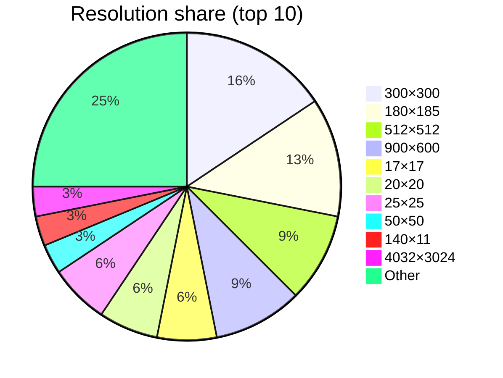

# HTML 图片分辨率统计报告

- **总图片引用数**: 32
- **不同分辨率数**: 18

## 分辨率分布表

| 分辨率 (宽×高) | 出现次数 | 占比 |
|----------------|----------|------|
| 300 × 300 | 5 | 15.62% |
| 180 × 185 | 4 | 12.50% |
| 512 × 512 | 3 | 9.38% |
| 900 × 600 | 3 | 9.38% |
| 17 × 17 | 2 | 6.25% |
| 20 × 20 | 2 | 6.25% |
| 25 × 25 | 2 | 6.25% |
| 50 × 50 | 1 | 3.12% |
| 140 × 11 | 1 | 3.12% |
| 4032 × 3024 | 1 | 3.12% |
| 100 × 45 | 1 | 3.12% |
| 200 × 200 | 1 | 3.12% |
| 4608 × 3052 | 1 | 3.12% |
| 2000 × 1333 | 1 | 3.12% |
| 3472 × 4640 | 1 | 3.12% |
| 90 × 88 | 1 | 3.12% |
| 1024 × 1376 | 1 | 3.12% |
| 1 × 1 | 1 | 3.12% |

## 分布图（前 20 项）

```mermaid
xychart-beta
    title "Resolution distribution (top 20)"
    x-axis "300×300", "180×185", "512×512", "900×600", "17×17", "20×20", "25×25", "50×50", "140×11", "4032×3024", "100×45", "200×200", "4608×3052", "2000×1333", "3472×4640", "90×88", "1024×1376", "1×1"
    y-axis "Count" 0 --> 6
    bar [5, 4, 3, 3, 2, 2, 2, 1, 1, 1, 1, 1, 1, 1, 1, 1, 1, 1]
```

## 占比饼图（前 10 项）


